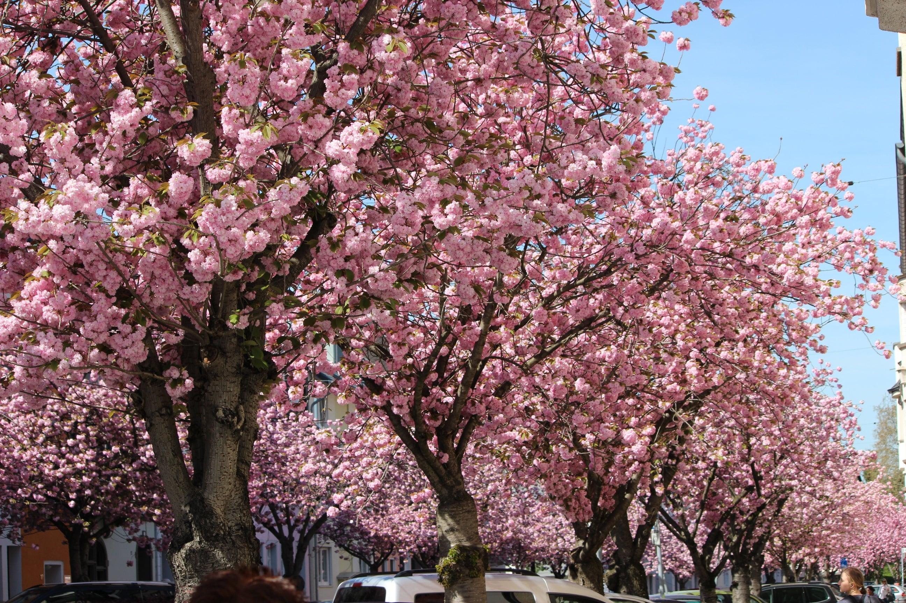
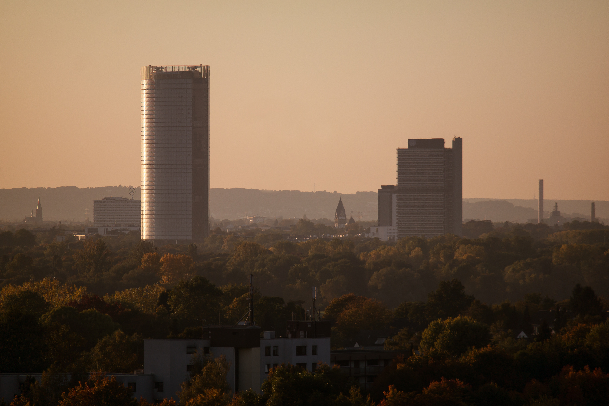

# Dynamische Hintergründe

## Aktuelles Thema: Kirschblüte Bonn

> Nachdem Berlin als Opener für die "Städte"-Thematik gesetzt wurde, sollte nun ein Frühlingsthema folgen.
Welche Stadt bietet sich hier besser an als Bonn mit seiner wunderschönen Kirschblüte?

### Bilder in dieser Periode:

