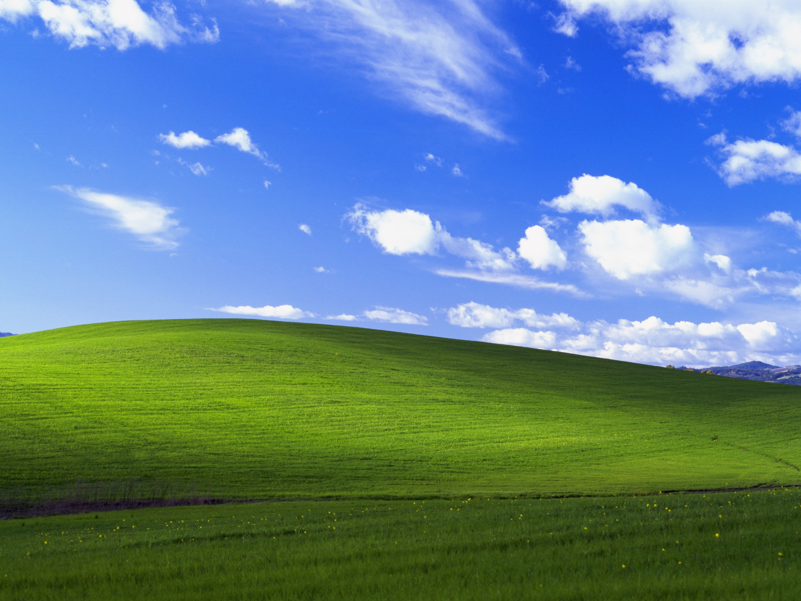
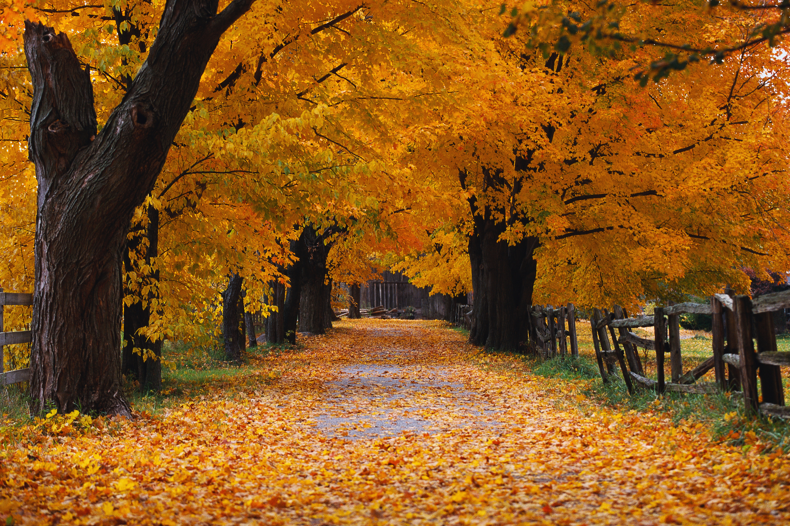

# Dynamische Hintergründe

## Aktuelles Thema: Default-Hintergründe (Windows XP)

> Dieses Hintergrundset ist der Default-Fallback, wenn kein anderes definiert wurde.
Aus diesem Grund habe ich mich hier für einen absoluten Klassiker entschieden:
Klassische Windows-XP Hintergründe!
Die gehen eigentlich immer :)

### Bilder in dieser Periode:

